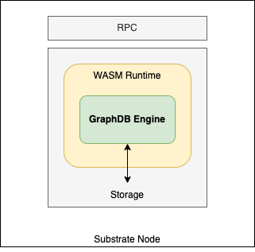

# Subgraph

`Subgraph` is a substrate pallet that allows anyone to use GraphDB in [Substrate platform](https://substrate.io/).
It supports the following specifications:
* [SPARQL 1.1 Query](https://www.w3.org/TR/sparql11-query/), [SPARQL 1.1 Update](https://www.w3.org/TR/sparql11-update/), and [SPARQL 1.1 Federated Query](https://www.w3.org/TR/sparql11-federated-query/).
* [Turtle](https://www.w3.org/TR/turtle/), [TriG](https://www.w3.org/TR/trig/), [N-Triples](https://www.w3.org/TR/n-triples/), and [N-Quads](https://www.w3.org/TR/n-quads/).
* [SPARQL 1.1 Query Results JSON Format](https://www.w3.org/TR/sparql11-results-json/) and [SPARQL 1.1 Query Results CSV and TSV Formats](https://www.w3.org/TR/sparql11-results-csv-tsv/).



## Usage

Before compile the src code, please make sure your OS has installed "cargo",which is the Rust build tool and package manager. 
#### Get and compile src code 
- Get the  src code 
```shell
git clone https://github.com/relationlabs/Relation-Graph.git
```
- Compile it 
```shell
cd /src
SKIP_WASM_BUILD=1 cargo build
```
#### Launch the compiled file
```shell
./target/debug/node-template --dev  --base-path ./test-chain
```

The more details of using this project, please reference the [prepare document](https://github.com/relationlabs/Relation-Graph/blob/main/docs/Documentation.md)


